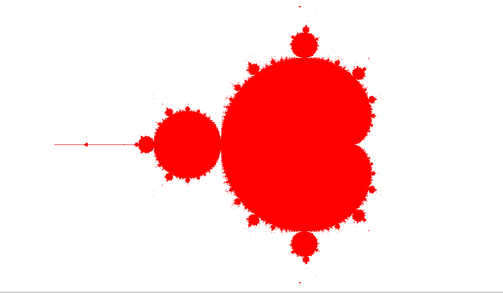

# Mandelbrot Set Visualizer

A desktop application for rendering and exploring the **Mandelbrot set**, built with **C#** and **Avalonia UI** targeting **.NET 9**.



## About

The Mandelbrot set is one of the most famous fractals in mathematics. A point $c$ in the complex plane belongs to the set if the sequence defined by:

$$z_{n+1} = z_n^2 + c, \quad z_0 = 0$$

remains bounded (does not diverge to infinity). This application renders the set on a 1000×1000 pixel canvas, coloring points that belong to the set in red.

## Features

- **Real-time rendering** of the Mandelbrot set
- **Pan navigation** using arrow keys to explore different regions
- **Zoom in** by pressing `Space` to increase magnification
- **Adaptive iteration count** — the maximum number of iterations automatically increases as you zoom deeper, improving detail at higher magnifications

## Controls

| Key | Action |
|---|---|
| `Arrow Up` | Pan up |
| `Arrow Down` | Pan down |
| `Arrow Left` | Pan left |
| `Arrow Right` | Pan right |
| `Space` | Zoom in |

## Performance Note

You can scroll (zoom) into the set to explore its infinitely complex boundary, but be aware that **performance degrades significantly after a few zoom levels**. The rendering is not heavily optimized — each zoom step requires recalculating every pixel on the canvas, and as the iteration count increases with deeper zoom levels, the computation becomes substantially more expensive. This is a known limitation of the current implementation and would require significant optimization (e.g., multithreading, GPU acceleration, or perturbation theory) to handle deep zooms smoothly.

## Getting Started

### Prerequisites

- [.NET 9 SDK](https://dotnet.microsoft.com/download/dotnet/9.0)

### Run

```bash
cd MandelBrot/MandelbrotApp
dotnet run
```

## Tech Stack

- **C#** / **.NET 9**
- **Avalonia UI 11.3** — cross-platform UI framework
- **WriteableBitmap** — pixel-level rendering
